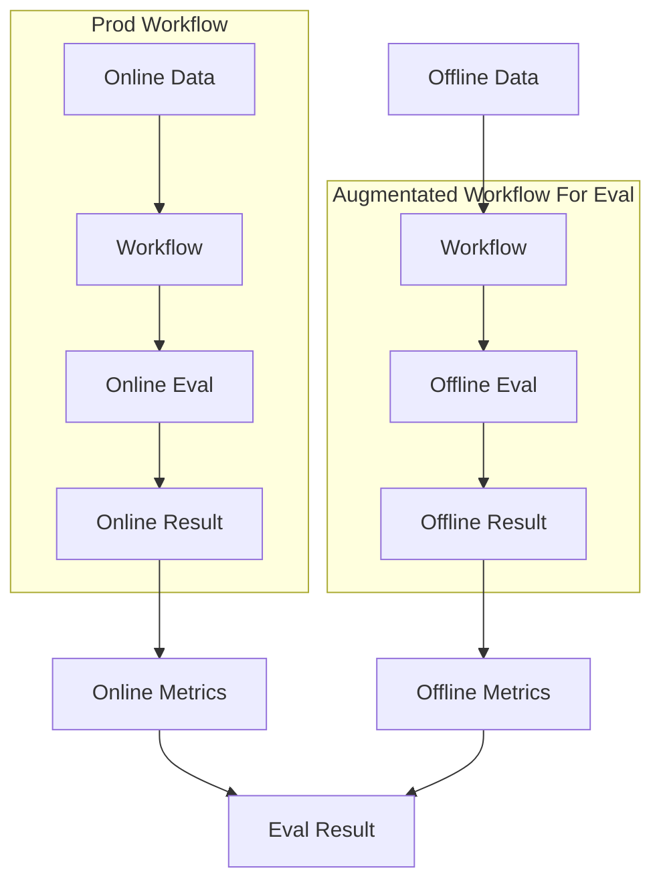
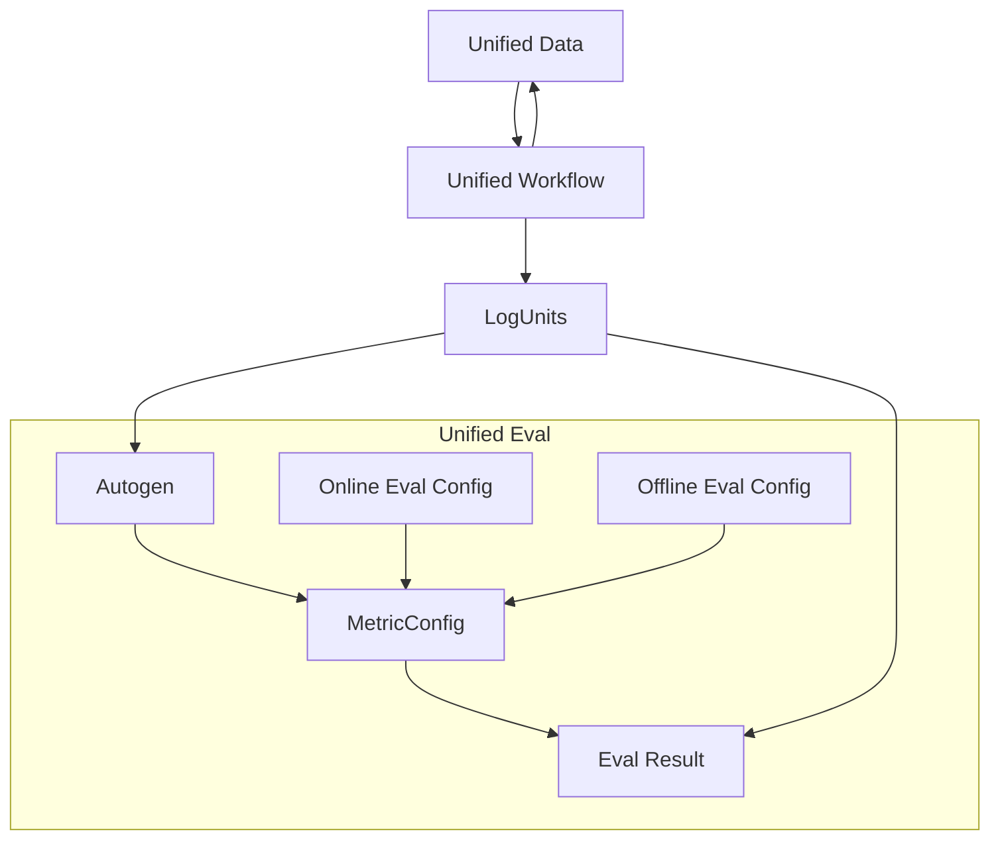
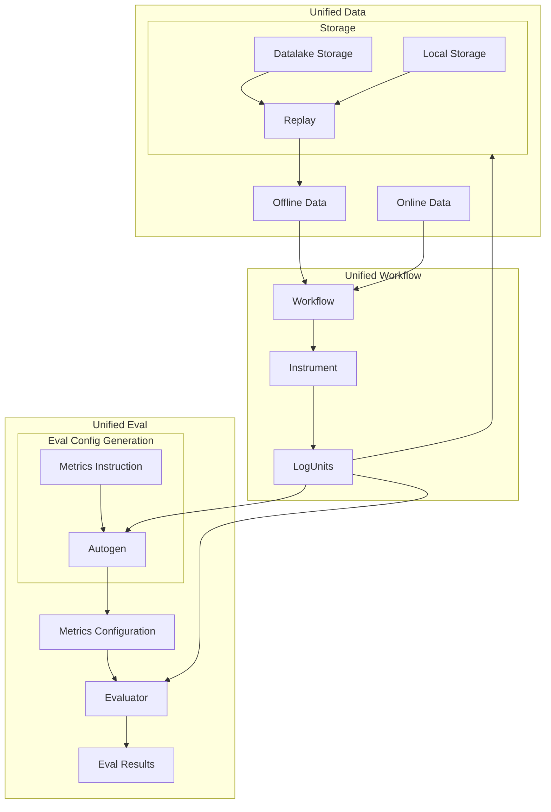
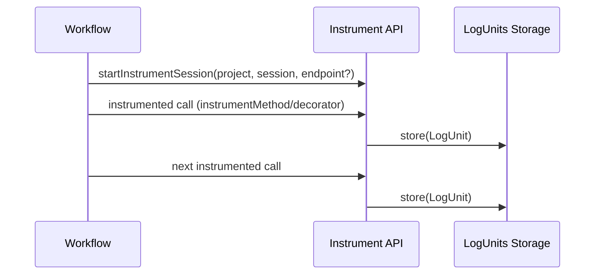
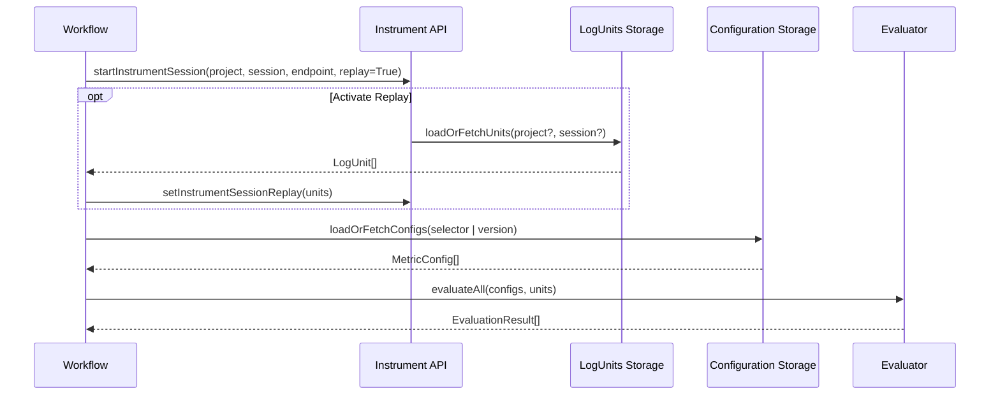
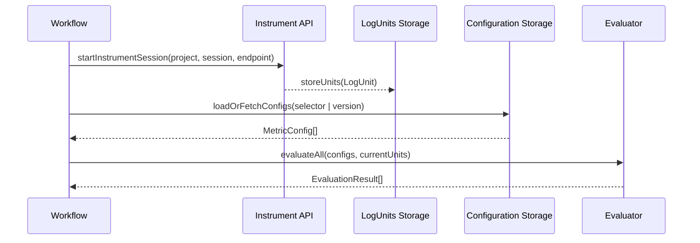
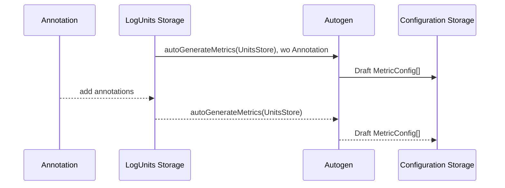

# System Design & User Instruction

> Components: `instrument` library + `datalake` service (+ `testbed` example)

> This document begins with the problem (why a new design is needed) before detailing goals and architecture.

## Design Goals
Resolve fragmentation, drift, and slow iteration through four concise goals:
1. Unified data collection & distribution
2. Unified evaluation pipeline
3. Unified research → production environment
4. Fast onboarding for non‑developer / third‑party users

### Design Support (Summary)
| Goal | How The Design Satisfies It |
|------|-----------------------------|
| Unified data collection & distribution | A single normalized execution record flows into a common storage structure (local or remote) for consistent cataloging, merging, and reuse without translation layers. |
| Unified evaluation pipeline | One scoring path operates purely on standardized records plus declarative metric definitions; identical artifacts drive online and offline assessment, reducing drift. |
| Unified research → production environment | Stable schemas and versioned configurations promote unchanged from exploratory usage to production, lowering maintenance and accelerating validation. |
| Fast onboarding for non‑developer / 3P users | Minimal steps: capture real executions, reference existing fields in human‑readable metric descriptions, optionally auto‑derive initial definitions; no code edits required to evolve metrics. |

## ❗ Why A New / Unified Design Is Needed
Production and evaluation historically ran as separate, loosely coupled workflows. Even when the same telemetry format could be emitted for live (online) and exported (offline) data, those artifacts still flowed through two distinct pipelines (prod usage vs. evaluation scripts) with fixed, code-embedded metrics. The unified design merges these paths by introducing a normalized execution record (LogUnit) and configuration-driven evaluation (MetricConfig), ensuring the same artifacts power both production capture and offline/online scoring without divergent loaders or hard-coded metric logic.

### Side-by-Side Prior vs Unified Design

<div style="display:flex; gap:24px; align-items:flex-start;">
<div style="flex:1; min-width:300px;">
<strong>Prior: Separate Workflows</strong>


<em>Caption:</em> Shared telemetry shape could exist, but two independent pipelines (prod vs offline evaluation) consumed it, creating drift, duplication, and slower iteration.

<strong>Key Traits (Prior)</strong>
<ul>
  <li>Hard-coded metric logic inside evaluation scripts.</li>
  <li>Two distinct loaders / execution paths (live vs offline export).</li>
  <li>Ad hoc record shapes; no normalized LogUnit contract.</li>
  <li>No autogen; metric evolution required code edits & redeploy.</li>
  <li>Replay relied on synthetic mocks or re-execution.</li>
  <li>High divergence risk: data shape & metric logic drift.</li>
  <li>Maintenance overhead: duplicate parsing & environment-specific glue.</li>
  <li>Slower iteration: export cycle gating metric changes.</li>
</ul>
</div>

<div style="flex:1; min-width:300px;">
<strong>Unified: LogUnit + Config-Based Evaluation</strong>


<em>Caption:</em> A single workflow produces canonical LogUnits powering both online & offline evaluation via declarative MetricConfig versions. Replay and autogen optionally leverage any captured fields (annotations are just additional tag data) and are omitted visually for simplicity.

<strong>Key Traits (Unified)</strong>
<ul>
  <li>Canonical LogUnit schema standardizes all execution footprints.</li>
  <li>Declarative MetricConfig (JSON) replaces hard-coded logic.</li>
  <li>Single ingestion surface: evaluator consumes <code>LogUnit[]</code> from any source.</li>
  <li>Deterministic replay using captured real units (no synthetic mocks).</li>
  <li>Autogen can propose metrics from existing captured fields (including optional annotation tag units) without code edits.</li>
  <li>Divergence risk reduced (shared artifacts & schema).</li>
  <li>Lower maintenance (one loader, one schema, versioned configs).</li>
  <li>Faster iteration (edit config / rerun; no export cycle gating).</li>
</ul>

<strong>Divergence Mitigations</strong>
<ul>
  <li>Metric drift: unified declarative configs.</li>
  <li>Data shape mismatch: stable LogUnit schema.</li>
  <li>Loader fragmentation: single LogUnit ingestion path.</li>
  <li>Slow evolution: config edits + autogen.</li>
  <li>Replay inconsistency: real-unit based substitution.</li>
  <li>Field discovery: autogen enumerates available captured fields (including annotation tag units).</li>
</ul>
</div>
</div>

### How The Current Design Satisfies Them
| Goal (Renumbered) | Design Support (Aspect-Focused) |
|-------------------|---------------------------------|
| 1. Unified data collection & distribution | A single, normalized execution record format flows from every runtime action into a common storage hierarchy. Both local and remote persistence use the same structural shape, enabling consistent cataloging, merging, and retrieval without translation layers or divergent loaders. This eliminates fragmentation and ensures that any captured unit can be redistributed or rehydrated in identical form across environments. |
| 2. Unified evaluation pipeline | Evaluation operates purely over the standardized records plus declarative metric definitions. The pipeline does not branch for online vs. offline: identical artifacts (records + configs) drive scoring, while deterministic reuse of previously captured records preserves behavior across time. This uniformity reduces drift and makes metric iteration independent of data acquisition mode. |
| 3. Unified research / prototyping / production environment | The same artifacts, schema, and configuration style advance unchanged from exploratory usage to production adoption. Versioned metric definitions and stable record semantics allow promotion without refactoring. Consistency of inputs and outputs across stages lowers maintenance and accelerates validation cycles. |
| 4. Boost start for non‑developer users | Minimal conceptual steps: capture actual executions into standardized records, reference existing fields in human-readable metric descriptions, and optionally derive initial definitions automatically from observed data fields (including human annotation records when present). This removes the need for code edits to evolve metrics, enabling rapid, iterative refinement and immediate application to freshly collected or historical datasets. |

## 🧩 Architecture Overview

<em>Caption:</em> Instrumentation is now depicted as part of the unified application/workflow (no separate workflow box). Functions/methods generate LogUnits via embedded instrumentation; LogUnits feed storage, replay re-injects into the unified app, autogen derives versioned MetricConfig, and evaluator consumes configs + units (+ replay) to produce results.

## Components

The system divides into two domains that form a closed loop: Data (capture, persistence, deterministic re‑use) and Evaluation (declarative judgment over captured reality). Components are described with design rationale plus high‑level interface shapes. The five core insights appear naturally throughout:
1. Expressions inside configurations provide real‑time evaluation of referenced LogUnit fields.
2. Collection and replay share the same Instrument API for frictionless integration.
3. LogUnit sources are location‑agnostic: local memory, local file, or remote datalake.
4. MetricConfig sources are likewise local (in‑repo) or remote (datalake version store).
5. Autogen can operate online with a prompt to tailor emergent metric definitions mid‑session.

### 1. Data

#### LogUnit Schema
Each LogUnit is a normalized envelope capturing one execution footprint: identity, timing, inputs (args), derived intermediates (vars), outcome (return / error), optional annotations, plus ordering markers for sequence reconstruction. Neutral field naming (no reliance on original call signatures) allows stable comparison across versions and teams.

Design properties:
1. Uniform shape (every operation emits the same structural pattern).
2. Additive evolution (new fields never invalidate prior records; consumers treat absence explicitly).
3. Transport neutrality (JSON/JSONL; same schema locally or remotely).
4. Temporal traceability (monotonic index + timestamps enable deterministic replay alignment).

High‑level interface (illustrative):
```ts
interface LogUnit {
  project: string;
  session: string;
  seq: number;            // ordering
  tagId: string;          // logical label (e.g. function name or annotation bucket)
  tsStart: number;        // epoch ms
  tsEnd: number;
  args?: Record<string, unknown>;
  vars?: Record<string, unknown>; // derived intermediates
  return?: unknown;
  error?: { message: string; stack?: string };
  annotations?: Record<string, unknown>; // optional human/system notes
  replayed?: boolean;     // true if substituted during replay
}
```

#### Collection
Collection transforms live workflow activity into LogUnits through a unified Instrument API. The same API can emit directly to memory, to a local file sink, or POST to a remote datalake endpoint without altering user code. Reliability (ordering, idempotence) and schema conformity are enforced at the ingestion layer; downstream consumers treat all sources identically.

Key considerations:
1. Single API surface: `logCall`, decorators, or inline logging produce canonical units.
2. Pluggable sinks: in‑memory array, file append, HTTP batching.
3. Source abstraction: evaluators receive `LogUnit[]` without caring about origin (local vs remote).
4. Immediate availability: captured units become evaluable as soon as appended.

Instrument surface (subset):
```ts
function startInstrumentSession(project: string, session: string, endpoint?: string): LogUnit[];
function logCall<T extends (...a: any[]) => any>(fn: T, opts: { label: string; logArgs?: boolean; logReturn?: boolean; params?: string[] }): T;
function logInline(tagId: string, payload: Record<string, unknown>): void; // for annotations or ad hoc units
```

#### Replay
Replay uses previously captured LogUnits as authoritative substitutes for live executions—through the *same* Instrument API surface. When enabled, calls matching historical units (by tagId + sequence heuristics) return prior `return` payloads and restore recorded `vars` / `args` deterministically.

Guarantees:
1. Determinism across evaluation cycles (metrics see identical data).
2. Isolation from external variability (no network, model drift).
3. Safety: original persisted set remains immutable; replay works on copies.
4. Seamlessness: enabling replay does not change call sites.

Replay activation:
```ts
function setInstrumentSessionReplay(units: LogUnit[]): void; // subsequent instrumented calls may be substituted
```

### 2. Evaluation

#### Configuration Schema
Metric configuration is declarative. It references LogUnit content using *expressions*—path or computed selectors resolved at evaluation time over the current unit set (replayed or live). Expressions allow real‑time derivation without embedding custom code.

Interface sketch:
```ts
type Expression = string; // e.g. "fetchContext.args.question" or DSL: "len(planGenerator.return) > 3"

interface MetricConfig {
  name: string;
  methodology: string;            // e.g. 'string_match', 'QAG'
  query: Record<string, Expression>; // named inputs resolved live
  params?: Record<string, unknown>;  // method-specific tuning
  version?: string;                  // remote version identifier
  promptContext?: string;            // optional autogen prompt (online customization)
}
```

Schema principles:
1. Declarative clarity (intent & inputs listed, not coded).
2. Versionable (remote datalake may assign immutable version IDs).
3. Composable (higher-level sets aggregate multiple metrics).
4. Expression-driven (dynamic evaluation over local or remote sourced units).

#### Configuration‑Based Evaluation
Evaluation resolves expressions against the current `LogUnit[]` (live or replayed) and applies methodology logic. The engine is content‑centric: it neither cares where units or configs originated nor whether execution is offline (static set) or online (streaming). Config retrieval may be local (`MetricConfig[]`) or a remote reference (`"project:latest"`).

Evaluator surface:
```ts
type MetricSource = MetricConfig[] | string; // string = remote version selector

interface EvaluationResult {
  metric: string;
  passed: boolean;
  score?: number;
  details?: Record<string, unknown>;
  version?: string;
}

async function evaluateAll(source: MetricSource, units: LogUnit[]): Promise<EvaluationResult[]>;
```

Properties:
1. Uniform flow (same code path for offline vs online vs replay scenarios).
2. Drift resistance (config versions unify historical & current scoring).
3. Auditability (results link metric name + version + resolved expressions).
4. Extensibility (new methodologies register without breaking existing configs).

#### Configuration Auto Generation
Autogen inspects available fields (including annotation units) and optionally uses a *prompt* to steer metric proposal (online customization). Generated metrics appear as draft `MetricConfig[]` with expression queries already mapped to discovered LogUnit paths, ready for refinement or persistence.

Interface sketch:
```ts
async function autoGenerateMetrics(units: LogUnit[], prompt?: string): Promise<MetricConfig[]>;
```

Advantages:
1. Rapid coverage (surfaces evaluable relationships early).
2. Democratization (non‑developers iterate via config edits instead of code changes).
3. Online adaptability (prompt-driven generation during live sessions).
4. Historical exploration (replay + autogen to discover latent evaluable signals).

## Flows

This section visualizes primary operational flows. Diagrams emphasize unified surfaces, local/remote symmetry, replay reuse, and online autogen.

### A. Data Collection Flow

<em>Insight: Pure capture path: Instrument API records executions into LogUnits Storage (memory/file/remote) without replay concerns.</em>

### B. Offline Evaluation Flow

<em>Insight: Single abstractions for units and configs hide local vs remote provenance.</em>

### C. Online Evaluation Flow (Streaming + Prompt Autogen Option)

<em>Insight: Autogen can run mid‑session with a customization prompt producing immediate evaluable configs.</em>

### D. Annotation & Configuration Update Flow

<em>Insight: Annotations reside inside LogUnits; config versions update and evaluation re-runs immediately using enriched unit content.</em>

---
These flows reinforce invariants: single Instrument API, expression‑based config referencing, replay determinism, symmetric local/remote sourcing, and online autogen adaptability.

## 🧪 Methodologies Overview (To be extended)
| Methodology | Purpose | Example Use |
|-------------|---------|-------------|
| `string_match` | Token/substring expectation validation | Check prefix or keyword presence in generated summary |
| `QAG` | Question–Answer relevance scoring (LLM / heuristic) | Ensure answer covers asked factual question |
| `DAG` | Step coverage / structural comparison | Verify generated plan includes required steps |

## ❓ FAQ
**Q: What does "decoupling instrument vs datalake" mean?**  
`instrument` & evaluator are content-centric: they define and consume the `LogUnit` & `MetricConfig` shapes only. They do not persist or version data. `datalake` is storage-centric: it organizes, versions, lists, and distributes data & configs. You can swap datalake for another store (files, S3, DB) by providing a sink and a loader that yield the same `LogUnit[]`.

**Q: Do I need datalake to evaluate?**  
No. You can evaluate purely on in-memory units captured locally or load data from local storage.

## 🔓 Decoupling: Responsibilities Matrix
| Concern | Instrument Library | Evaluator | Datalake Service |
|---------|--------------------|-----------|------------------|
| Emit execution data | Yes | No | No |
| Define data schema (LogUnit) | Yes | Reads | Persists |
| Define evaluation schema (MetricConfig) | Re-export | Yes | Stores versions |
| Version configs | No | Consumes | Yes |
| Replay support | Provides mechanism | Consumes units | Supplies source units |
| Annotation interpretation | Autogen augments | Consumes metrics | Stores annotation units |
| Storage medium abstraction | Sink mechanism | Path queries | Filesystem hierarchy |

This matrix highlights the clean separation: instrumentation/evaluation focus on content & logic; datalake focuses on durability, retrieval, and distribution.
