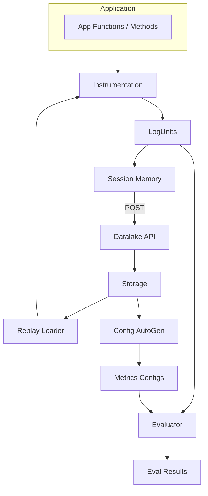
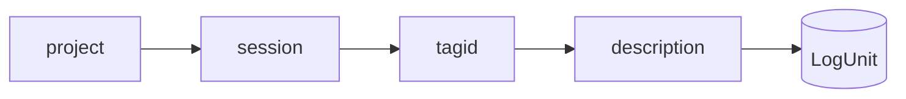
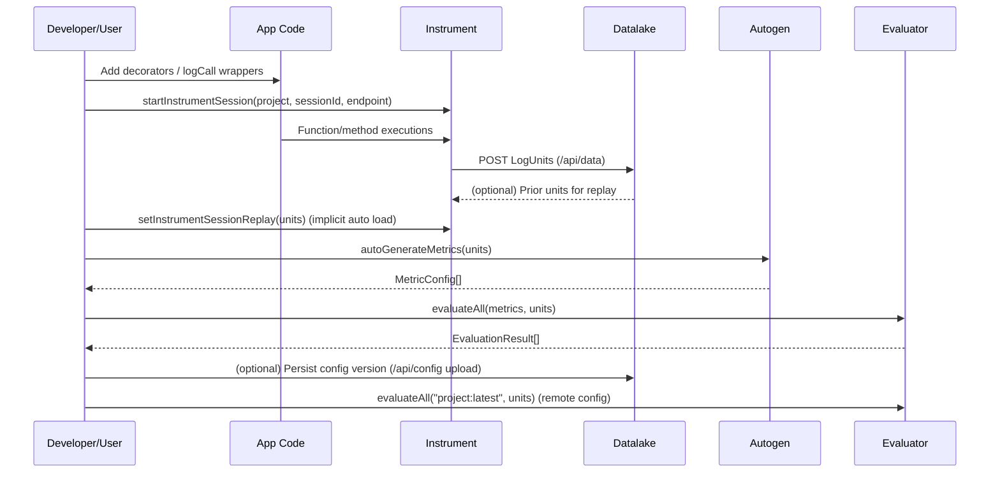

# System Design & User Instruction

> Components: `instrument` library + `datalake` service (+ `testbed` example)

> Goals: unified evaluation & data pipeline spanning offline/local dev, replay, and online production-like environments.

## 🎯 High-Level Design Goals
1. Unified offline/online eval pipeline
2. Unified data collection & distribution
3. Unified RPE (research/prototyping & experimentation) / prod environment surface
4. Fast start for non‑dev / 3P users to run evaluation with their own data

### How The Current Design Satisfies Them
| Goal | Design Support |
|------|----------------|
| 1. Unified eval pipeline | Shared LogUnit schema; metrics configs referencing tagId paths; replay reuses collected units for deterministic offline eval; same evaluator works on locally captured or remotely fetched units. |
| 2. Unified data collection/distribution | `instrument` emits standardized LogUnits; optional sink posts to `datalake` which stores JSONL under canonical hierarchy; retrieval API provides nested or flat views for reuse in config generation & evaluation. |
| 3. Unified RPE/prod environment | Same session API (`startInstrumentSession`, sinks) works locally or with remote endpoint; configs versioned / served from `datalake` (`project:latest`); remote fetching (`evaluateAll` shorthand) mirrors prod consumption. |
| 4. Fast start for non-dev users | Decorators & `logCall` require minimal code changes; autogen (`autoGenerateMetrics`) bootstraps metrics from existing data & annotations; replay enables running “as if” real calls without backend dependencies; simple curl-based ingest & browser UI list data. |

## 🧩 Architecture Overview

### Data Hierarchy (datalake)

Each JSONL line is a persisted record derived from a LogUnit emission: `{ project, session, tagid, description, timestamp, payload }`.

## 📦 Core Concepts
### 1. Instrument: What & Why
`instrument` provides runtime wrappers & decorators to capture structured execution footprints (arguments, variables, return values, errors, timing) into `LogUnit`s.

Key APIs:
- `logCall(fn, options)` – Wrap a function.
- Decorators: `@LogMethod()`, `@LogAll()` – Instrument a single method or all methods of a class.
- Inline capture: `logInline(label, value)`, `logVar(label, value)` / `logVars({...})`.
- Sessions: `startInstrumentSession(project, sessionId, endpoint?)` – Attach contextual project/session + sink posting to datalake. Returns array for live access to emitted units.
- Replay control: `setInstrumentSessionReplay(units)` / `clearInstrumentSessionReplay()` – Override live emitted args/vars/return from prior captured units.

Design choices:
- Uses `AsyncLocalStorage` to thread session & call context through sync/async boundaries.
- Extensible sink: default console vs. HTTP POST to datalake endpoint.
- Redaction & selective param logging to protect sensitive inputs.
- Deterministic evaluation surface: every captured call transforms into a uniform `LogUnit`.

### 2. Replay: Purpose
Replay enables deterministic re-execution of evaluation logic without invoking original implementations or external dependencies. By loading previously persisted units (auto fetched on session start if endpoint + project + session match) it can:
- Replace live arguments/vars/returns with historical values (`payload.replayed = true`).
- Short-circuit flaky or slow operations for faster iterative metric tuning.
- Guarantee consistency for offline regression checks.

### 3. Configuration-Based Evaluation Framework
Evaluation is driven by declarative `MetricConfig[]` describing:
- `methodology`: algorithmic strategy (string match, QAG, DAG).
- `query`: map of logical input names -> path expressions referencing LogUnit context (`<tagId>.<field>`).
- `params`: methodology-specific knobs (thresholds, case sensitivity, etc.).

Benefits:
- No hard-coded metric logic inside application code.
- Allows versioning & remote distribution (store configs, fetch via `project:latest`).
- Facilitates quick addition/removal/refinement without code redeploy.

### 4. Autogen (`autoGenerateMetrics` / `autoGenerate`)
Autogen is a bootstrapping utility that inspects collected `LogUnit`s (including optional annotation units) to propose initial metrics. Today it:
- Loads a seed metrics template (`testbed/src/eval.metrics.json`).
- Augments with annotation-derived metric if `tagId === 'annotations'` exists (e.g., `annotation_summary`).
- Optionally enriches descriptions with a provided prompt.
Future expansions can infer expected outputs, coverage targets, or dynamic methodology selection based on payload patterns.

### 5. Annotation Support
Annotations are special `LogUnit`s (e.g., manual labels, human judgments) captured with `tagId: 'annotations'` or user-defined tag IDs. Autogen derives metric keys from annotation payload fields (`summary`, others). This enables:
- Human-in-the-loop evaluation seeding.
- Hybrid automatic + manual scoring (e.g., compare model output to annotated summaries).

## 🔁 End-to-End Evaluation Pipeline


## 🛠 Usage Instructions / Demos
### A. How Instrument Works
```ts
import { logCall, startInstrumentSession } from '@workspace/instrument';

function add(a: number, b: number) { return a + b; }
const loggedAdd = logCall(add, { label: 'add', logArgs: true, logReturn: true });

const units = startInstrumentSession('demo', 's1', 'http://localhost:3300');
loggedAdd(2, 3);
console.log(units.length); // 1
```
Decorator variant:
```ts
import { LogMethod, startInstrumentSession } from '@workspace/instrument';
class Calculator {
  @LogMethod({ logArgs: true, logReturn: true })
  multiply(x: number, y: number) { return x * y; }
}
startInstrumentSession('demo', 's2');
new Calculator().multiply(4, 5);
```
Selective parameter logging (use replay for return overrides):
```ts
const fetchUser = async (id: string, authToken: string) => ({ id, name: 'Jane' });
const wrapped = logCall(fetchUser, {
  label: 'fetchUser',
  params: ['id'],        // only log id, hides authToken
  logArgs: true,
  logReturn: true,
});
// To override the return deterministically, capture a prior session and call:
// setInstrumentSessionReplay(previousUnitsWithFetchUserCalls)
```

### B. How Autogen Config Works
```ts
import { autoGenerateMetrics } from '@workspace/instrument';
// After session concluded or mid-flight access live units
const metrics = await autoGenerateMetrics(units, 'Initial bootstrapping prompt');
// metrics: MetricConfig[] (seed + possible annotation-derived metric)
```
Each metric’s `query` maps logical names to tag paths:
```json
{
  "name": "insightHasSummary",
  "methodology": "string_match",
  "query": {
    "target": "getMeetingInsight.return",
    "expected": "getMeetingInsight.vars.prompt.value"
  },
  "params": { "caseSensitive": false }
}
```

### C. How Replay Works
Automatic replay when starting session with endpoint and matching prior data:
```ts
startInstrumentSession('demo', 'previousSession', 'http://localhost:3300');
// instrument will auto-load historical units and override live call outcomes.
```
Manual replay:
```ts
import { setInstrumentSessionReplay } from '@workspace/instrument';
setInstrumentSessionReplay(previousUnitsSubset); // tagId keyed; args/vars/return override
```
Replay replaces prior mockReturn capability:
- To override outputs, capture a previous session's units and apply `setInstrumentSessionReplay(units)`; args/vars/return fields are substituted and flagged with `replayed: true`.

### D. With Annotation vs Without
Without annotations: Autogen uses base template only.
With annotations: Units having `tagId === 'annotations'` produce additional metrics keyed by discovered fields (e.g., `annotation_summary`). Add annotation data by logging a unit:
```ts
logInline('annotations', { summary: 'User intent classification looks correct.' });
```

### E. Offline vs Online Data Evaluation
We distinguish evaluation contexts by data freshness and acquisition path, not by code changes. Instrumentation always emits `LogUnit`s; evaluation always consumes `LogUnit[]` + `MetricConfig[]`.

| Mode | Data Source | Freshness | Examples | Typical Tools | Notes |
|------|-------------|-----------|----------|---------------|-------|
| Offline (historical) | Previously captured units from datalake (`GET /api/data`) | Stale / point-in-time | Re-running yesterday's session; regression suite | `startInstrumentSession` + manual load; replay; `evaluateAll` | May use replay to avoid external calls; units can be loaded via a local file loader instead of service. |
| Offline (local file) | JSONL / JSON exported or side-loaded | Static | Team-shared dataset on disk | Custom dataloader -> `LogUnit[]` | Datalake optional; shape must match `LogUnit`. |
| Offline (annotation-enhanced) | Historical units + annotation tag units | Static + curated | Human labeled summaries / correctness tags | Autogen + `annotation_*` metrics | Adds derived metrics from annotation payload fields. |
| Online (real-time) | Live instrumentation posting to datalake | Fresh / streaming | Current session executing now | `startInstrumentSession(project, session, endpoint)` | Evaluation can run mid-flight on partial unit set. |
| Online (real-time + annotation) | Live units + operator/manual annotation capture | Fresh + evolving | Real-time QA / triage | Inline `logInline('annotations', {...})` | Enables immediate feedback loop for adaptive metrics. |

Offline evaluation means the units are already materialized (could still be pulled from datalake, just not live). Online evaluation means units are arriving and being appended as code executes.

Flows:
1. Offline (historical from datalake):
  - Query datalake for `project`/`session` -> assemble `units[]`.
  - Optionally `setInstrumentSessionReplay(units)` to simulate calls deterministically.
  - Load metrics (`local file` or `project:latest`).
  - `evaluateAll(metrics, units)`.
2. Offline (local file loader):
  - Parse JSONL file(s) into `LogUnit[]`.
  - Run autogen if desired; evaluate.
3. Offline with annotations:
  - Ensure annotation tag units exist (e.g., `annotations`).
  - `autoGenerateMetrics(units)` adds annotation-derived metrics.
  - Evaluate; compare annotated vs generated output signals.
4. Online real-time:
  - Start session with endpoint.
  - Periodically snapshot current in-memory `units` array (it grows).
  - Evaluate incrementally (streaming scoring) or at end.
5. Online with live annotations:
  - Same as online; at any point log annotation unit.
  - Re-run autogen to incorporate new fields; continue evaluation.

Hybrid pattern: Fetch remote config (`project:latest`) but evaluate exclusively on replayed historical units—useful for ensuring new metric versions retain backward compatibility before deploying live instrumentation changes.

Design invariant: evaluation code never inspects "where" the units came from—just their content. This supports decoupling and portability.

### Fetch Remote Config Example
```ts
import { evaluateAll } from '@workspace/instrument';
const results = await evaluateAll('demo:latest', units); // remote metrics fetch
```
Or using client:
```ts
import { EvalClient } from '@workspace/instrument';
const client = new EvalClient('http://localhost:3300');
const results = await client.evaluate('demo:latest', units);
```

### Metrics Evaluation Result Handling
```ts
import { evaluateAll, printEvaluationTable } from '@workspace/instrument';
const results = await evaluateAll(metrics, units);
printEvaluationTable(results); // Console PASS/FAIL table
```

## 🔐 Redaction & Privacy
- Provide `redact(key, value)` in InstrumentOptions to transform sensitive data during serialization.
- Selective param logging prevents accidental exposure of secrets (e.g., only log `id`, skip `authToken`).

## 🧪 Methodologies Overview
| Methodology | Purpose | Example Use |
|-------------|---------|-------------|
| `string_match` | Token/substring expectation validation | Check prefix or keyword presence in generated summary |
| `QAG` | Question–Answer relevance scoring (LLM / heuristic) | Ensure answer covers asked factual question |
| `DAG` | Step coverage / structural comparison | Verify generated plan includes required steps |

## ⚙ Path Query Semantics
Metric `query` paths use `<tagId>.<field>` addressing into a tag-context object built from `LogUnit`s. Fields originate from `payload` keys (`args`, `vars`, `return`).
Examples:
- `fetchContext.args.question` → argument `question` of `fetchContext`.
- `getMeetingInsight.vars.prompt.value` → captured variable `prompt` value.
- `planGenerator.return` → returned value of `planGenerator`.


## 🚀 Fast Start Checklist (Non-Dev / 3P)
1. Start datalake (already running in provided environment).
2. Wrap functions with `logCall` or add `@LogMethod()` decorators.
3. Call `startInstrumentSession('yourProject', 'session1', 'http://localhost:3300')`.
4. Exercise your code / send test inputs.
5. (Optional) Add annotations via `logInline('annotations', { summary: 'Expected behavior...' })`.
6. Run `autoGenerateMetrics(units)` to obtain initial metrics.
7. Review/edit metrics JSON (adjust thresholds).
8. Run `evaluateAll(metrics, units)`; inspect PASS/FAIL.
9. Iterate: adjust code or metrics; reuse replay to avoid recomputation.
10. Fetch remote config later via `project:latest` for consistent evaluation across teams.

## 🔄 Change & Versioning Strategy
- Metrics JSON lives under versioned sets in datalake (served by `/api/config`).
- Code-level instrumentation changes do not break evaluation as long as tagIds remain stable.
- Add new tags (functions/methods) incrementally; extend metrics referencing them.

## 📈 Extensibility Points
- New methodologies: implement `evaluate(ctx)` returning `EvaluationResult` and register under `REGISTRY`.
- Autogen heuristics: analyze payload patterns to infer query mappings.
- Replay enhancements: partial arg overrides, time-shift simulation.
- Annotation workflows: integrate UI for manual labeling.

## ❓ FAQ
**Q: What does "decoupling instrument vs datalake" mean?**  
`instrument` & evaluator are content-centric: they define and consume the `LogUnit` & `MetricConfig` shapes only. They do not persist or version data. `datalake` is storage-centric: it organizes, versions, lists, and distributes data & configs. You can swap datalake for another store (files, S3, DB) by providing a sink and a loader that yield the same `LogUnit[]`.

**Q: Do I need datalake to evaluate?**  
No. You can evaluate purely on in-memory units captured locally.

## ✅ Summary
This system unifies instrumentation, data persistence, replay, configuration-based metrics, and automated metric bootstrapping. It lowers friction for experimentation and production convergence, enabling deterministic, repeatable, and extensible evaluation workflows for both developers and non-developers.

---
Last updated: 2025-10-17

## 🔓 Decoupling: Responsibilities Matrix
| Concern | Instrument Library | Evaluator | Datalake Service |
|---------|--------------------|-----------|------------------|
| Emit execution data | Yes | No | No |
| Define data schema (LogUnit) | Yes | Reads | Persists |
| Define evaluation schema (MetricConfig) | Re-export | Yes | Stores versions |
| Persist data | Optional (via sink) | No | Yes |
| Version configs | No | Consumes | Yes |
| Replay support | Provides mechanism | Consumes units | Supplies source units |
| Annotation interpretation | Autogen augments | Consumes metrics | Stores annotation units |
| Storage medium abstraction | Sink mechanism | Path queries | Filesystem hierarchy |

This matrix highlights the clean separation: instrumentation/evaluation focus on content & logic; datalake focuses on durability, retrieval, and distribution.